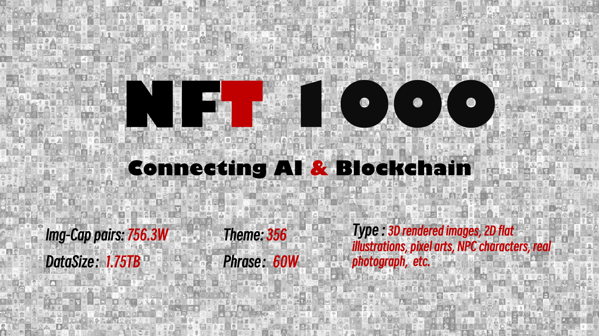

[](https://huggingface.co/datasets/shuxunoo/NFT-Net)[](https://arxiv.org/abs/2402.16872)[](https://www.nftscan.com/ai-search)
[](https://github.com/ShuxunoO/NFT-Net)

[中文版](README_ZH.md) | [English Version](README.md)

<br>


# 🗺︎  RoadMap

- [2023-03-30] ⛵ Project Creation；

- [2023-11] 🪨 Complete the collection and organization of [NFT1000](https://huggingface.co/datasets/shuxunoo/NFT-Net/tree/main/NFT1000) dataset；

- [2023-12-30] 📄 Paper based on NFT1000 was submitted to ICME 2024；

- [2024-3-12] 💔 Paper was rejected by ICME；🩶

- [2024-04-12] 📄 A better paper was finished and submitted to ACM Multimedia 2024；

- [2024-07-15] 🥳 Paper [**“NFT1000: A Cross-Modal Dataset For Non-Fungible Token Retrieval”**](https://openreview.net/forum?id=xUtNrKH8iB&noteId=xUtNrKH8iB) was accepted by  MM！🎊

- [2024-9] 💾 Open source the whole dataset,progress： ███████████████████████░ [980/1001]
- [2024-10-25] 🎉 MM2024 Poster was released！
  <details>
    <summary>Click here to see ACMMM2024 Poster</summary>
    
  </details>

  Please visit the [Hugging Face](https://huggingface.co/datasets/shuxunoo/NFT-Net) for more details~

- ……


<br>


# 📸 NFT-Net Overview

[NFT](https://zh.wikipedia.org/wiki/NFT) (Non-Fungible Token) is a new type of digital asset that represents ownership or proof of authenticity of unique items, such as artwork, music, videos, or virtual goods, on a blockchain. Unlike cryptocurrencies like Bitcoin, which are fungible and can be exchanged on a one-to-one basis, NFTs are one-of-a-kind and cannot be exchanged for something of equal value. Each NFT has a unique identifier, making it valuable for collectors, creators, and digital markets. As an essential digital asset in the [Web 3.0](https://zh.wikipedia.org/wiki/Web3) world, NFTs are set to play an increasingly important role. Given that the academic community currently lacks a dataset focused on NFTs, we have created **[NFT-Net](https://huggingface.co/datasets/shuxunoo/NFT-Net)**, aiming to inspire and foster research and development in the field of NFTs!

The **[ImageNet](https://www.image-net.org/)** is a milestone in the field of computer vision, driving advancements and cross-industry applications, such as autonomous driving and medical image analysis. Building on this legacy, we aim to create a comprehensive dataset for the Web3.0 domain: NFT-Net, which is designed to be the Web3.0 counterpart of ImageNet！

NFT-Net is a multi-chain, multi-category, and multimodal dataset focused on Non-Fungible Tokens (NFTs). Each NFT project in the dataset serves as a basic unit, encompassing metadata, standardized image data (img), captions (text descriptions extracted from metadata for image-text alignment training), prompts (text labels derived from metadata for generative model training), and a dashboard (an overview of the project). Our long-term goal is to collect NFT projects across multiple blockchains (e.g., Ethereum, Solana, BTC) and categories (PFP, Arts, Photographs, Games, etc.), thus advancing research in NFT-related areas such as retrieval, generation, and quantitative trading.

Now，we have already achieved significant milestones with the development of the [NFT1000](https://huggingface.co/datasets/shuxunoo/NFT-Net/tree/main/NFT1000) dataset! NFT1000 consists of the top 1000 (1001, in fact) most popular PFP NFT projects on the Ethereum blockchain, comprising 7.56 million image-text pairs, totaling 1.75TB of data. The dataset includes 356 themes and 600,000 noun phrases, making it suitable for various downstream tasks such as NFT retrieval, generation, and visual question answering. Additionally, our research based on the NFT1000 dataset has been recognized, with the paper titled "NFT1000: A Cross-Modal Dataset For Non-Fungible Token Retrieval" being accepted by [ACM Multimedia 2024](https://2024.acmmm.org/registration), one of the top three conferences in the field of multimedia AI.


<br>


## 🔥 Introduction of NFT1000


<br>

The [NFT1000](https://huggingface.co/datasets/shuxunoo/NFT-Net/tree/main/NFT1000) dataset comprises 1000 outstanding PFP NFT projects, each containing approximately 7500 image-text pairs, encompassing a total of 7.56 million image-text pairs with a collective data volume of 1.75TB.

In the dataset, the training set includes 800 projects with 6,178,249 image-text pairs. The validation set comprises 50 projects with 383,916 image-text pairs, and the test set consists of 150 projects with 1,000,838 imagetext pairs. The content spans a diverse range of artistic types, including 3D rendered images, 2D flat illustrations, pixel arts, NPC characters, real photographs,etc. It covers a total of 356 different content themes and 595,504 unique descriptive phrases.

<br>




### 📃 Project list of NFT1000

The NFT1000 dataset comprises the most renowned 1000 avatar NFT projects from the Ethereum mainnet, based on sales data 2023-6-23.（Interestingly, there are actually 1001 projects included, as my own project, [BanaCat](https://opensea.io/collection/banacat-v2), is among them）. These NFT projects have laid the foundations of the early NFT ecosystem and have heralded the golden era of NFTs!


<details>
<summary>Click here to see NFT1000 demo projects</summary>

  | index | NFT_name | collected_tokens | index | NFT_name | collected_tokens | index | NFT_name | collected_tokens | index | NFT_name | collected_tokens | index | NFT_name | collected_tokens |
  |-------|----------|------------------|-------|----------|------------------|-------|----------|------------------|-------|----------|------------------|-------|----------|------------------|
  | 1     | [BoredApeYachtClub](http://www.boredapeyachtclub.com/) | 10000 | 2     | [CRYPTOPUNKS](https://cryptopunks.app/) | 10000 | 3     | [MutantApeYachtClub](https://boredapeyachtclub.com/#/home) | 19482 | 4     | [Azuki](http://www.azuki.com) | 10000 | 5     | [CloneX](http://www.rtfkt.com) | 19485 |
  | 6     | [Moonbirds](https://proof.xyz/moonbirds) | 10000 | 7     | [Doodles](https://doodles.app) | 10000 | 8     | [BoredApeKennelClub](http://boredapeyachtclub.com/#/kennel-club) | 9597 | 9     | [Cool Cats](http://coolcatsnft.com) | 9965 | 10    | [Beanz](https://www.azuki.com/beanz) | 19950 |
  | 11    | [PudgyPenguins](https://www.pudgypenguins.com/) | 8888 | 12    | [Cryptoadz](https://cryptoadz.io) | 7024 | 13    | [World Of Women](http://worldofwomen.art) | 10000 | 14    | [CyberKongz](http://cyberkongz.com) | 5000 | 15    | [0N1 Force](https://0N1force.com) | 7777 |
  | 16    | [MekaVerse](https://themekaverse.com/) | 8888 | 17    | [HAPE PRIME](https://hape.io/) | 8192 | 18    | [mfers](https://opensea.io/collection/mfers) | 10000 | 19    | [projectPXN](http://phantom.sh) | 10000 | 20    | [Karafuru](http://karafuru.io) | 5555 |
  | 21    | [Invisible Friends](https://invisiblefriends.io) | 5000 | 22    | [FLUF](https://fluf.world/) | 10000 | 23    | [Milady](https://miladymaker.net) | 10000 | 24    | [goblintown](https://goblintown.wtf/) | 9999 | 25    | [Phanta Bear](https://ezek.io/) | 10000 |
  | 26    | [CyberKongz VX](http://cyberkongz.com) | 14672 | 27    | [KaijuKingz](https://kaijukingz.io/#/) | 9999 | 28    | [Prime Ape Planet](https://primeplanet.io/) | 7979 | 29    | [Lazy Lions](http://lazylionsnft.com) | 10000 | 30    | [3Landers](https://3landersnft.com/) | 9981 |
  | 31    | [The Doge Pound](https://thedogepoundnft.com/) | 10000 | 32    | [DeadFellaz](https://deadfellaz.io) | 10000 | 33    | [World Of Women Galaxy](https://worldofwomen.art/wow-galaxy) | 20789 | 34    | [ALIENFRENS](http://alienfrens.io) | 10000 | 35    | [VOX Series 1](http://collectvox.com) | 8889 |
  | 36    | [Hashmasks](https://www.thehashmasks.com/) | 16355 | 37    | [Psychedelics Anonymous Genesis](https://psychedelicsanonymous.com/) | 9595 | 38    | [VeeFriends Series 2](https://series2.veefriends.com) | 55554 | 39    | [RENGA](https://renga.app/) | 8898 | 40    | [CoolmansUniverse](https://coolmansuniverse.com/) | 10000 |
  | 41    | [Art Gobblers](https://artgobblers.com/) | 9988 | 42    | [SupDucks](https://www.supducks.com/) | 9916 | 43    | [Jungle Freaks](http://junglefreaks.io) | 10000 | 44    | [Sneaky Vampire Syndicate](https://svs.gg) | 8888 | 45    | [SuperNormalbyZipcy](https://opensea.io/collection/slokh) | 8851 |
  | 46    | [Nakamigos](https://nakamigos.io/) | 20000 | 47    | [Impostors Genesis](https://impostors.gg) | 10420 | 48    | [Potatoz](https://www.memeland.com/potatoz) | 9999 | 49    | [CryptoSkulls](https://cryptoskulls.com) | 10000 | 50    | [Moonbirds Oddities](https://www.oddities.xyz/) | 10000 |
  | 51    | [RumbleKongLeague](http://www.rumblekongleague.com) | 10000 | 52    | [MURI](https://www.muri.soy/) | 10000 | 53    | [Galactic Apes](https://opensea.io/collection/galacticapes) | 9998 | 54    | [Lives of Asuna](https://livesofasuna.com) | 9997 | 55    | [My Pet Hooligan](http://mypethooligan.com) | 8888 |
  | 56    | [Murakami.Flowers](https://murakamiflowers.kaikaikiki.com/) | 10105 | 57    | [Kiwami](https://kiwami.app/) | 10000 | 58    | [SHIBOSHIS](https://shiboshis.shibaswap.com/#/) | 10000 | 59    | [Sappy Seals](https://sappyseals.io) | 10000 | 60    | [DEGEN TOONZ](https://degentoonz.io) | 8888 |
  | 61    | [Killer GF](https://killergf.com/) | 7777 | 62    | [CryptoMories](https://cryptomories.iwwon.com/home) | 9583 | 63    | [Crypto Bull Society](http://cryptobullsociety.com) | 7777 | 64    | [CryptoBatz by Ozzy Osbourne](https://www.cryptobatz.com/) | 9666 | 65    | [Quirkies](https://quirkies.io/) | 5000 |
  | 66    | [Robotos](https://www.robotos.art) | 9999 | 67    | [Tubby Cats](http://tubbycats.xyz) | 20000 | 68    | [Chain Runners](http://chainrunners.xyz) | 10000 | 69    | [MutantCats](https://mutantverse.io/) | 9698 | 70    | [Boss Beauties](http://www.bossbeauties.com) | 9999 |
  | 71    | [OnChainMonkey](https://onchainmonkey.com/) | 9501 | 72    | [Rektguy](https://rektguy.com) | 8814 | 73    | [Desperate ApeWives](https://desperateapewives.com) | 10000 | 74    | [DigiDaigaku](https://digidaigaku.com/) | 2022 | 75    | [DeGods](https://degods.com) | 9066 |
  | 76    | [apekidsclub](http://www.apekidsclub.io) | 9999 | 77    | [The Humanoids](http://thehumanoids.com) | 9901 | 78    | [Sevens Token](https://thesevensofficial.com/) | 7000 | 79    | [Akutars](https://www.aku.world/) | 15000 | 80    | [HypeBears](http://hypebears.io) | 10000 |
  | 81    | [Hero](https://raid.party/) | 5205 | 82    | [KIA](https://koalaintelligence.agency) | 9998 | 83    | [inbetweeners](https://www.inbetweeners.io/) | 10777 | 84    | [C-01 Official Collection](https://c-01nft.io/) | 8887 | 85    | [Imaginary Ones](https://imaginaryones.com) | 8888 |
  | 86    | [ZombieClub Token](https://zombieclub.io/) | 5478 | 87    | [Groupies](http://os.peacevoid.world) | 10000 | 88    | [Valhalla](http://joinvalhalla.com) | 9000 | 89    | [MOAR by Joan Cornella](https://joancornella.fwenclub.com/) | 5555 | 90    | [Wizards & Dragons Game](https://wnd.game/) | 45519 |
  | 91    | [the littles NFT](http://thelittles.io) | 10000 | 92    | [The Heart Project](http://heartnfts.io) | 9931 | 93    | [CryptoDads](http://www.CryptoDadsNFT.com) | 10000 | 94    | [Chimpers](https://www.chimpers.xyz/) | 5555 | 95    | [Crypto Chicks](https://www.cryptochicks.app/) | 9970 |
  | 96    | [VOX Series 2](http://collectvox.com) | 8473 | 97    | [WonderPals](http://www.wonderpals.com) | 10000 | 98    | [LilPudgys](https://www.pudgypenguins.com/) | 21243 | 99    | [a KID called BEAST](https://akidcalledbeast.com) | 9631 | 100   | [Akuma](https://www.akumaorigins.com) | 5553 |
  | ...   | ...      | ...              | ...   | ...      | ...              | ...   | ...      | ...              | ...   | ...      | ...              | ...   | ...      | ...              |
  | 1000  | [Women Unite - 10k Assemble](https://opensea.io/collection/women-unite-10k-assemble) | 6991 | 1001  | [BanaCat](https://opensea.io/collection/banacat-v2) | 9710 |       |                  |       |       |                  |       |       |                  |       |

</details>


Please visit [📃PDF](assets/Details_of_NFT_collections_in_the_NFT1000_dataset.pdf) for the total list！

<br>

### 🛻 Download NFT1000
You have two methods for downloading the NFT1000:
#### 1. Download for 🤗Hugging Face 

Visit the Hugging Face official repository at：[**NFT-NET**](https://huggingface.co/datasets/shuxunoo/NFT-Net/tree/main/NFT1000)，and clone the repository or download each project on click


<br>


#### 2. Use the NFT-NET-HUB

[**NFT-NET-HUB**](https://github.com/ShuxunoO/NFT-NET-Hub) is a package management tool specifically designed to accompany the NFT-NET dataset. You can use the corresponding script to flexibly download specific projects, such as:


```python

from utils.downloader import NFT1000

local_repo_path = "absolute/absolute/path/to/local/repo"
# modfiy the NFT_name_list to the NFT projects you want to download
NFT_name_list = ["BoredApeYachtClub", "CRYPTOPUNKS"]

NFT1000 = NFT1000("NFT1000", local_repo_path)
NFT1000.download(NFT_name_list)

```

For a more detailed tutorial, please refer to: [**NFT-NET-HUB**](https://github.com/ShuxunoO/NFT-NET-Hub)


<br>


## 📄 Introduction of NFT1000 paper

NFT1000 is a research paper focused on cross-modal retrieval on NFT data. This work marks the first application of cross-modal retrieval technologies to NFT data, utilizing intelligent search technologies from **Web 2.0** in the context of **Web 3.0**. Our key contributions of this paper include:

- **Dataset Construction**: We constructed the first NFT visual-text dataset in the field of computer vision, named **[NFT1000](https://huggingface.co/datasets/shuxunoo/NFT-Net/tree/main/NFT1000)**.
- **Training Methodology**: We propose an effective training method for NFT-type data, termed the dynamic masking fine-tuning scheme, and have trained several models to serve as our baseline.
- **Similarity Quantification**: To quantify image-text similarity, we introduce the Comprehensive Variance Index (CVI, in short), which accounts for similarities within images and texts, as well as the degree of image-text matching.
- **Application in Image Generation**: We also explore the application of NFT data in the field of image generation.

And this paper was accepted by [**ACM Multimedia 2024**](https://openreview.net/forum?id=xUtNrKH8iB&noteId=xUtNrKH8iB)! Please refer to [📄full paper](https://arxiv.org/abs/2402.16872) for more details!

<br>

Based on the research in the paper, we jointly developed an NFT search engine with NFTScan.**You can try our online search demo at : https://www.nftscan.com/ai-search**
[](https://www.nftscan.com/ai-search)

<br>

## Contributors

Thank you 🙏 to all our contributors!

<a href="https://github.com/ShuxunoO/NFT-Net/graphs/contributors">
</a>

<br>
<br>

## Parters


[**WTF Academy**](https://www.wtf.academy/) | [**NFTScan**](https://www.nftscan.com/) | [**Alchemy**](https://www.alchemy.com/) | [**NFTGO**](https://nftgo.io/ethereum) | [**Hugging Face**](https://huggingface.co/) | [**OpenSea**](https://opensea.io/) | [**GCC**](https://www.gccofficial.org/) | [**BABEL**](https://metalanguage.notion.site/BABEL-AGI-d9d6572ac4c543679ec87c93a7a20c1f)

<br>
<br>


<br>

## ⚠ Recommendations and Warnings ☢
All data in the NFT-NET dataset is for scientific research only. Please do not use it for any commercial non-academic purposes such as secondary sales! Downloading data means that you comply with this agreement by default, and any disputes arising from this will be the responsibility of the downloader himself!

<br>

## Authors and Citation

```
@inproceedings{
wang2024nft,
title={{NFT}1000: A Cross-Modal Dataset For Non-Fungible Token Retrieval},
author={Shuxun Wang and Yunfei Lei and Ziqi Zhang and Wei Liu and Haowei Liu and Li Yang and Bing Li and Wenjuan Li and Jin Gao and Weiming Hu},
booktitle={ACM Multimedia 2024},
year={2024},
url={https://openreview.net/forum?id=xUtNrKH8iB}
}
```
