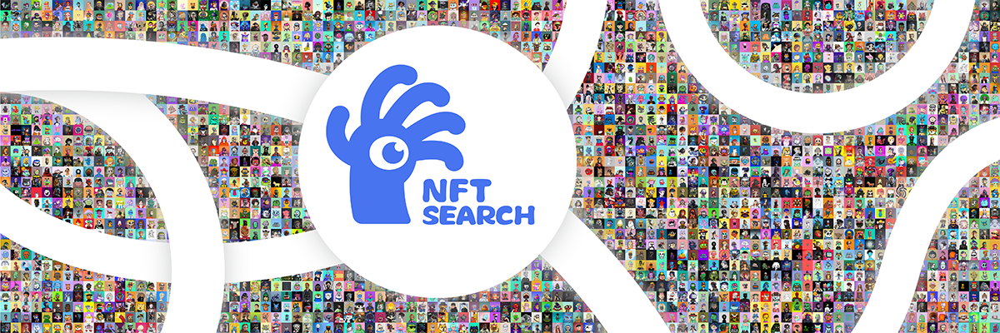

[](https://huggingface.co/datasets/shuxunoo/NFT-Net)[](https://arxiv.org/abs/2402.16872)[](https://www.nftscan.com/ai-search)[](https://github.com/ShuxunoO/NFT-Net)


# 🗺︎  RoadMap

- [2023-03-30] ⛵ Project Creation；

- [2023-11] 🪨 Complete the collection and organization of [NFT1000](https://huggingface.co/datasets/shuxunoo/NFT-Net) dataset；

- [2023-12-30] 📄 Paper based on NFT1000 was submitted to ICME 2024；

- [2024-3-12] 💔 Paper was rejected by ICME；🩶

- [2024-04-12] 📄 A better paper was finished and submitted to ACM Multimedia 2024；

- [2024-07-15] 🥳 Paper [**“NFT1000: A Cross-Modal Dataset For Non-Fungible Token Retrieval”**](https://openreview.net/forum?id=xUtNrKH8iB&noteId=xUtNrKH8iB) was accepted by  MM！🎊

- [2024-9] 💾 Open source the whole dataset,progress： ██████████████░░░ [850/1001]

  Please visit the [Hugging Face](https://huggingface.co/datasets/shuxunoo/NFT-Net) for more details~

- ……


# 📸 NFT-Net Overview

[NFT](https://zh.wikipedia.org/wiki/NFT) (Non-Fungible Token) is a new type of digital asset that represents ownership or proof of authenticity of unique items, such as artwork, music, videos, or virtual goods, on a blockchain. Unlike cryptocurrencies like Bitcoin, which are fungible and can be exchanged on a one-to-one basis, NFTs are one-of-a-kind and cannot be exchanged for something of equal value. Each NFT has a unique identifier, making it valuable for collectors, creators, and digital markets. As an essential digital asset in the [Web 3.0](https://zh.wikipedia.org/wiki/Web3) world, NFTs are set to play an increasingly important role. Given that the academic community currently lacks a dataset focused on NFTs, we have created **[NFT-Net](https://huggingface.co/datasets/shuxunoo/NFT-Net)**, aiming to inspire and foster research and development in the field of NFTs!

The **[ImageNet](https://www.image-net.org/)** is a milestone in the field of computer vision, driving advancements and cross-industry applications, such as autonomous driving and medical image analysis. Building on this legacy, we aim to create a comprehensive dataset for the Web3.0 domain: NFT-Net, which is designed to be the Web3.0 counterpart of ImageNet！

NFT-Net is a multi-chain, multi-category, and multimodal dataset focused on Non-Fungible Tokens (NFTs). Each NFT project in the dataset serves as a basic unit, encompassing metadata, standardized image data (img), captions (text descriptions extracted from metadata for image-text alignment training), prompts (text labels derived from metadata for generative model training), and a dashboard (an overview of the project). Our long-term goal is to collect NFT projects across multiple blockchains (e.g., Ethereum, Solana, BTC) and categories (PFP, Arts, Photographs, Games, etc.), thus advancing research in NFT-related areas such as retrieval, generation, and quantitative trading.

Now，we have already achieved significant milestones with the development of the [NFT1000](https://huggingface.co/datasets/shuxunoo/NFT-Net) dataset! NFT1000 consists of the top 1000 (1001, in fact) most popular PFP NFT projects on the Ethereum blockchain, comprising 7.56 million image-text pairs, totaling 1.75TB of data. The dataset includes 356 themes and 600,000 noun phrases, making it suitable for various downstream tasks such as NFT retrieval, generation, and visual question answering. Additionally, our research based on the NFT1000 dataset has been recognized, with the paper titled "NFT1000: A Cross-Modal Dataset For Non-Fungible Token Retrieval" being accepted by ACM Multimedia 2024, one of the top three conferences in the field of multimedia AI.


## Introduction of NFT1000


The [NFT1000](https://huggingface.co/datasets/shuxunoo/NFT-Net) dataset comprises 1000 outstanding PFP NFT projects, each containing approximately 7500 image-text pairs, encompassing a total of 7.56 million image-text pairs with a collective data volume of 1.75TB.

In the dataset, the training set includes 800 projects with 6,178,249 image-text pairs. The validation set comprises 50 projects with 383,916 image-text pairs, and the test set consists of 150 projects with 1,000,838 imagetext pairs. The content spans a diverse range of artistic types, including 3D rendered images, 2D flat illustrations, pixel arts, NPC characters, real photographs,etc. It covers a total of 356 different content themes and 595,504 unique descriptive phrases.


### Project list of NFT1000

| index | NFT_name                                                     | collected_tokens | index | NFT_name                                                     | collected_tokens |
| :---- | ------------------------------------------------------------ | ---------------- | ----- | ------------------------------------------------------------ | ---------------- |
| 1     | [BoredApeYachtClub](https://www.boredapeyachtclub.com/)      | 10000            | 2     | [CRYPTOPUNKS](https://cryptopunks.app/)                      | 10000            |
| 3     | [MutantApeYachtClub](https://boredapeyachtclub.com/#/home)   | 19482            | 4     | [Azuki](https://www.azuki.com/zh)                            | 10000            |
| 5     | [CloneX](https://rtfkt.com/)                                 | 19485            | 6     | [Moonbirds](https://www.proof.xyz/moonbirds)                 | 10000            |
| 7     | [Doodles](https://www.doodles.app/)                          | 10000            | 8     | [BoredApeKennelClub](https://boredapeyachtclub.com/#/kennel-club) | 9597             |
| 9     | [Cool Cats](https://coolcats.com/)                           | 9965             | 10    | [Beanz](https://www.0n1force.com/)                           | 19950            |
| 11    | [PudgyPenguins](https://www.pudgypenguins.com/)              | 8888             | 12    | [Cryptoadz](https://www.cryptoadz.io/)                       | 7024             |
| ……    | ……                                                           | ……               | ……    | ……                                                           | ……               |
| 1000  | [Women Unite - 10k Assemble](https://opensea.io/collection/women-unite-10k-assemble) | 6991             | 1001  | [BanaCat](https://opensea.io/collection/banacat-v2)          | 9710             |

Please visit [📃PDF](assets/Details_of_NFT_collections_in_the_NFT1000_dataset.pdf) for the total list！


[source paper](assets/ACM_MM_NFT1000_Final_Version.pdf)

[introduction slides](assets/NFT-Net_A_Non_Fungible_Token_Cross-Modal_Dataset_for_AI_Research.pptx)

[introduction pdf](assets/NFT-Net_A_Non_Fungible_Token_Cross-Modal_Dataset_for_AI_Research.pdf)



**You can try our online search demo at : https://www.nftscan.com/ai-search**


## Contributors

Thank you 🙏 to all our contributors!

<a href="https://github.com/ShuxunoO/NFT-Net/graphs/contributors">
</a>


## Parters


## Authors and Citation

```
@inproceedings{
wang2024nft,
title={{NFT}1000: A Cross-Modal Dataset For Non-Fungible Token Retrieval},
author={Shuxun Wang and Yunfei Lei and Ziqi Zhang and Wei Liu and Haowei Liu and Li Yang and Bing Li and Wenjuan Li and Jin Gao and Weiming Hu},
booktitle={ACM Multimedia 2024},
year={2024},
url={https://openreview.net/forum?id=xUtNrKH8iB}
}
```
