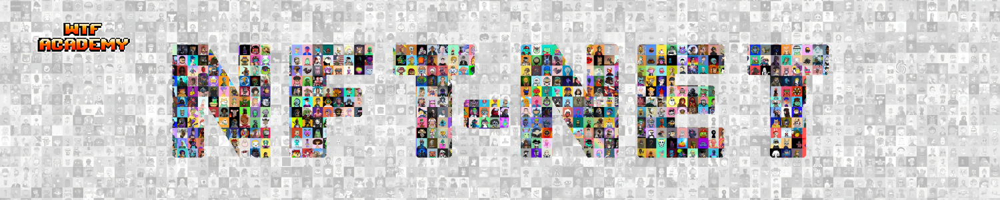
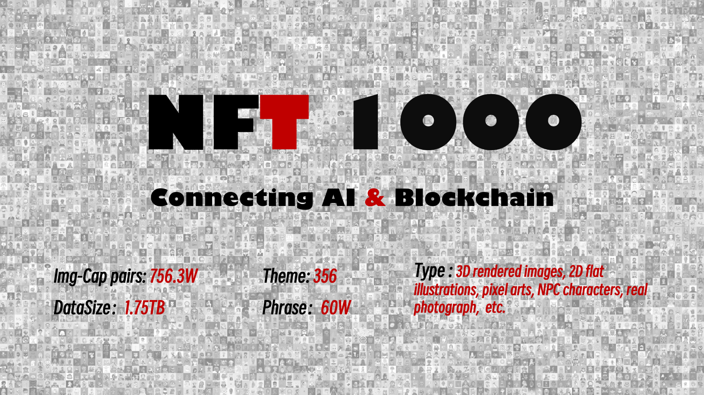
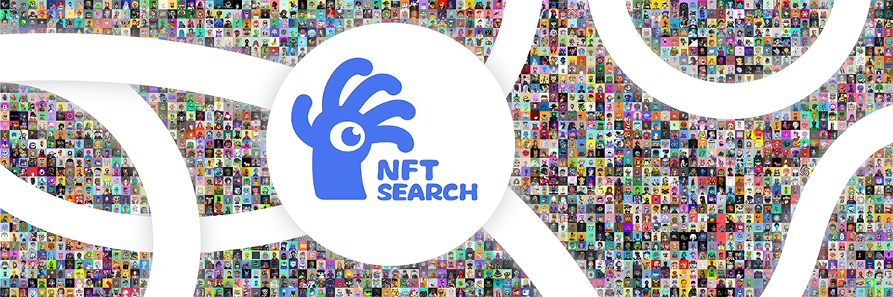
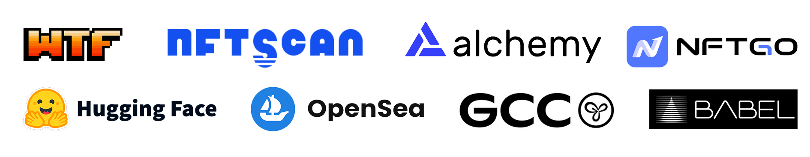

[](https://huggingface.co/datasets/shuxunoo/NFT-Net)[](https://arxiv.org/abs/2402.16872)[](https://www.nftscan.com/ai-search)[](https://github.com/ShuxunoO/NFT-NET-Hub)
[](https://github.com/ShuxunoO/NFT-Net)

[English Version](README.md) | [中文版](README_ZH.md)

<br>


# 🗺︎ 路线图

- [2023-03-30] ⛵ 项目创建；
- [2023-11] 🪨 完成 [NFT1000](https://huggingface.co/datasets/shuxunoo/NFT-Net/tree/main/NFT1000) 数据集的收集和组织；
- [2023-12-30] 📄 基于 NFT1000 的论文提交至 ICME 2024；
- [2024-3-12] 💔 论文被 ICME 拒绝；🩶
- [2024-04-12] 📄 更好的论文完成并提交至 ACM Multimedia 2024；
- [2024-07-15] 🥳 论文 [**“NFT1000: A Cross-Modal Dataset For Non-Fungible Token Retrieval”**](https://openreview.net/forum?id=xUtNrKH8iB&noteId=xUtNrKH8iB) 被 MM 接受！🎊
- [2024-9] 💾 开源整个数据集，进度： ████████████████████████ [1001/1001]
- [2024-10-25] 🎉 MM2024 海报已发布！  
    <details>
      <summary>点击这里查看ACMMM2024 Poster</summary>
      
    </details>


  请访问 [Hugging Face](https://huggingface.co/datasets/shuxunoo/NFT-Net) 获取更多详情~

- ……

<br>

# 📸 NFT-Net 概述

[NFT](https://zh.wikipedia.org/wiki/NFT)（非同质化代币）是一种新型数字资产，代表着对独特物品（如艺术品、音乐、视频或虚拟商品）的所有权或真实性证明，并记录在区块链上。与比特币等可互换的加密货币不同，NFT 是独一无二的，无法与等值物品交换。每个 NFT 都有一个唯一标识符，使其对收藏家、创作者和数字市场具有价值。作为 [Web 3.0](https://zh.wikipedia.org/wiki/Web3) 世界中的重要数字资产，NFT 将在未来扮演越来越重要的角色。鉴于学术界目前缺乏专注于 NFT 的数据集，我们创建了 **[NFT-Net](https://huggingface.co/datasets/shuxunoo/NFT-Net)**，旨在激发和促进 NFT 领域的研究和发展！

**[ImageNet](https://www.image-net.org/)** 是计算机视觉领域的里程碑，推动了自动驾驶、物品识别、医学图像分析等跨行业应用的发展。受到其启发，我们旨在为 Web3.0 领域创建一个全面对标ImageNet的数据集：NFT-Net！

NFT-Net 是一个多链、多类别和多模态的数据集，专注于非同质化代币（NFT）。数据集中的每个 NFT 项目作为基本单位，包含元数据、标准化图像数据（img）、caption（从元数据中提取的文本描述，用于图像-文本对齐训练）、prompt（从元数据中提取的文本标签，用于生成模型训练）和dashboard（项目概览）。我们的长期目标是收集跨多个区块链（例如，以太坊、Solana、BTC）和类别（PFP、艺术、摄影、游戏等）的 NFT 项目，从而推动 NFT 相关领域的研究，如检索、生成和量化交易。

目前，我们已经在开发 [NFT1000](https://huggingface.co/datasets/shuxunoo/NFT-Net/tree/main/NFT1000) 数据集方面取得了重大进展！NFT1000 由以太坊区块链上最受欢迎的 1000 个（实际上是 1001 个）PFP NFT 项目组成，包含 756 万对图像-文本对，总数据量为 1.75TB。数据集包括 356 个主题和 60 万个名词短语，适用于 NFT 检索、生成和视觉问答等各种下游任务。此外，基于 NFT1000 数据集的研究已被认可，题为 "NFT1000: A Cross-Modal Dataset For Non-Fungible Token Retrieval" 的论文被多媒体 AI 领域的三大会议之一 [ACM Multimedia 2024](https://2024.acmmm.org/registration) 接收。

<br>

## 🔥 NFT1000 简介


<br>

[NFT1000](https://huggingface.co/datasets/shuxunoo/NFT-Net/tree/main/NFT1000) 数据集由 1000 个杰出的 PFP NFT 项目组成，每个项目包含约 7500 对图像-文本对，总共 756 万对图像-文本对，数据总量为 1.75TB。

在数据集中，训练集包括 800 个项目，包含 6,178,249 对图像-文本对。验证集包括 50 个项目，包含 383,916 对图像-文本对，测试集包括 150 个项目，包含 1,000,838 对图像-文本对。内容涵盖多种艺术类型，包括 3D 渲染图像、2D 平面插图、像素艺术、NPC 角色、真实照片等。总共涵盖 356 个不同的内容主题和 595,504 个独特的描述短语。

<br>



### 📃 NFT1000 项目列表

NFT1000 数据集由以太坊主网上最著名的 1000 个头像 NFT 项目组成，基于 2023-6-23 的销售数据。（有趣的是，实际上包含 1001 个项目，因为我自己的项目 [BanaCat](https://opensea.io/collection/banacat-v2) 也在其中）。这些 NFT 项目奠定了早期 NFT 生态系统的基础，并预示着 NFT 的黄金时代！

<br>

🍊**NFT1000 项目列表**
<br>

  | index | NFT_name | collected_tokens | index | NFT_name | collected_tokens | index | NFT_name | collected_tokens | index | NFT_name | collected_tokens | index | NFT_name | collected_tokens |
  |-------|----------|------------------|-------|----------|------------------|-------|----------|------------------|-------|----------|------------------|-------|----------|------------------|
  | 1     | [BoredApeYachtClub](http://www.boredapeyachtclub.com/) | 10000 | 2     | [CRYPTOPUNKS](https://cryptopunks.app/) | 10000 | 3     | [MutantApeYachtClub](https://boredapeyachtclub.com/#/home) | 19482 | 4     | [Azuki](http://www.azuki.com) | 10000 | 5     | [CloneX](http://www.rtfkt.com) | 19485 |
  | 6     | [Moonbirds](https://proof.xyz/moonbirds) | 10000 | 7     | [Doodles](https://doodles.app) | 10000 | 8     | [BoredApeKennelClub](http://boredapeyachtclub.com/#/kennel-club) | 9597 | 9     | [Cool Cats](http://coolcatsnft.com) | 9965 | 10    | [Beanz](https://www.azuki.com/beanz) | 19950 |
  | 11    | [PudgyPenguins](https://www.pudgypenguins.com/) | 8888 | 12    | [Cryptoadz](https://cryptoadz.io) | 7024 | 13    | [World Of Women](http://worldofwomen.art) | 10000 | 14    | [CyberKongz](http://cyberkongz.com) | 5000 | 15    | [0N1 Force](https://0N1force.com) | 7777 |
  | 16    | [MekaVerse](https://themekaverse.com/) | 8888 | 17    | [HAPE PRIME](https://hape.io/) | 8192 | 18    | [mfers](https://opensea.io/collection/mfers) | 10000 | 19    | [projectPXN](http://phantom.sh) | 10000 | 20    | [Karafuru](http://karafuru.io) | 5555 |
  | 21    | [Invisible Friends](https://invisiblefriends.io) | 5000 | 22    | [FLUF](https://fluf.world/) | 10000 | 23    | [Milady](https://miladymaker.net) | 10000 | 24    | [goblintown](https://goblintown.wtf/) | 9999 | 25    | [Phanta Bear](https://ezek.io/) | 10000 |
  | 26    | [CyberKongz VX](http://cyberkongz.com) | 14672 | 27    | [KaijuKingz](https://kaijukingz.io/#/) | 9999 | 28    | [Prime Ape Planet](https://primeplanet.io/) | 7979 | 29    | [Lazy Lions](http://lazylionsnft.com) | 10000 | 30    | [3Landers](https://3landersnft.com/) | 9981 |
  | 31    | [The Doge Pound](https://thedogepoundnft.com/) | 10000 | 32    | [DeadFellaz](https://deadfellaz.io) | 10000 | 33    | [World Of Women Galaxy](https://worldofwomen.art/wow-galaxy) | 20789 | 34    | [ALIENFRENS](http://alienfrens.io) | 10000 | 35    | [VOX Series 1](http://collectvox.com) | 8889 |
  | 36    | [Hashmasks](https://www.thehashmasks.com/) | 16355 | 37    | [Psychedelics Anonymous Genesis](https://psychedelicsanonymous.com/) | 9595 | 38    | [VeeFriends Series 2](https://series2.veefriends.com) | 55554 | 39    | [RENGA](https://renga.app/) | 8898 | 40    | [CoolmansUniverse](https://coolmansuniverse.com/) | 10000 |
  | 41    | [Art Gobblers](https://artgobblers.com/) | 9988 | 42    | [SupDucks](https://www.supducks.com/) | 9916 | 43    | [Jungle Freaks](http://junglefreaks.io) | 10000 | 44    | [Sneaky Vampire Syndicate](https://svs.gg) | 8888 | 45    | [SuperNormalbyZipcy](https://opensea.io/collection/slokh) | 8851 |
  | 46    | [Nakamigos](https://nakamigos.io/) | 20000 | 47    | [Impostors Genesis](https://impostors.gg) | 10420 | 48    | [Potatoz](https://www.memeland.com/potatoz) | 9999 | 49    | [CryptoSkulls](https://cryptoskulls.com) | 10000 | 50    | [Moonbirds Oddities](https://www.oddities.xyz/) | 10000 |
  | 51    | [RumbleKongLeague](http://www.rumblekongleague.com) | 10000 | 52    | [MURI](https://www.muri.soy/) | 10000 | 53    | [Galactic Apes](https://opensea.io/collection/galacticapes) | 9998 | 54    | [Lives of Asuna](https://livesofasuna.com) | 9997 | 55    | [My Pet Hooligan](http://mypethooligan.com) | 8888 |
  | 56    | [Murakami.Flowers](https://murakamiflowers.kaikaikiki.com/) | 10105 | 57    | [Kiwami](https://kiwami.app/) | 10000 | 58    | [SHIBOSHIS](https://shiboshis.shibaswap.com/#/) | 10000 | 59    | [Sappy Seals](https://sappyseals.io) | 10000 | 60    | [DEGEN TOONZ](https://degentoonz.io) | 8888 |
  | 61    | [Killer GF](https://killergf.com/) | 7777 | 62    | [CryptoMories](https://cryptomories.iwwon.com/home) | 9583 | 63    | [Crypto Bull Society](http://cryptobullsociety.com) | 7777 | 64    | [CryptoBatz by Ozzy Osbourne](https://www.cryptobatz.com/) | 9666 | 65    | [Quirkies](https://quirkies.io/) | 5000 |
  | 66    | [Robotos](https://www.robotos.art) | 9999 | 67    | [Tubby Cats](http://tubbycats.xyz) | 20000 | 68    | [Chain Runners](http://chainrunners.xyz) | 10000 | 69    | [MutantCats](https://mutantverse.io/) | 9698 | 70    | [Boss Beauties](http://www.bossbeauties.com) | 9999 |
  | 71    | [OnChainMonkey](https://onchainmonkey.com/) | 9501 | 72    | [Rektguy](https://rektguy.com) | 8814 | 73    | [Desperate ApeWives](https://desperateapewives.com) | 10000 | 74    | [DigiDaigaku](https://digidaigaku.com/) | 2022 | 75    | [DeGods](https://degods.com) | 9066 |
  | 76    | [apekidsclub](http://www.apekidsclub.io) | 9999 | 77    | [The Humanoids](http://thehumanoids.com) | 9901 | 78    | [Sevens Token](https://thesevensofficial.com/) | 7000 | 79    | [Akutars](https://www.aku.world/) | 15000 | 80    | [HypeBears](http://hypebears.io) | 10000 |
  | 81    | [Hero](https://raid.party/) | 5205 | 82    | [KIA](https://koalaintelligence.agency) | 9998 | 83    | [inbetweeners](https://www.inbetweeners.io/) | 10777 | 84    | [C-01 Official Collection](https://c-01nft.io/) | 8887 | 85    | [Imaginary Ones](https://imaginaryones.com) | 8888 |
  | 86    | [ZombieClub Token](https://zombieclub.io/) | 5478 | 87    | [Groupies](http://os.peacevoid.world) | 10000 | 88    | [Valhalla](http://joinvalhalla.com) | 9000 | 89    | [MOAR by Joan Cornella](https://joancornella.fwenclub.com/) | 5555 | 90    | [Wizards & Dragons Game](https://wnd.game/) | 45519 |
  | 91    | [the littles NFT](http://thelittles.io) | 10000 | 92    | [The Heart Project](http://heartnfts.io) | 9931 | 93    | [CryptoDads](http://www.CryptoDadsNFT.com) | 10000 | 94    | [Chimpers](https://www.chimpers.xyz/) | 5555 | 95    | [Crypto Chicks](https://www.cryptochicks.app/) | 9970 |
  | 96    | [VOX Series 2](http://collectvox.com) | 8473 | 97    | [WonderPals](http://www.wonderpals.com) | 10000 | 98    | [LilPudgys](https://www.pudgypenguins.com/) | 21243 | 99    | [a KID called BEAST](https://akidcalledbeast.com) | 9631 | 100   | [Akuma](https://www.akumaorigins.com) | 5553 |
  | ...   | ...      | ...              | ...   | ...      | ...              | ...   | ...      | ...              | ...   | ...      | ...              | ...   | ...      | ...              |
  | 1000  | [Women Unite - 10k Assemble](https://opensea.io/collection/women-unite-10k-assemble) | 6991 | 1001  | [BanaCat](https://opensea.io/collection/banacat-v2) | 9710 |       |                  |       |       |                  |       |       |                  |       |

<br>

请访问 [📃PDF](assets/Details_of_NFT_collections_in_the_NFT1000_dataset.pdf) 查看完整列表！

<br>


🍉**数据集目录结构**
```
NFT1000
└── BoredApeYachtClub
    ├── captions/  # Caption of each image
    │   ├── BoredApeYachtClub_0.txt
    │   ├── BoredApeYachtClub_1.txt
    │   ├── ...
    │   └── BoredApeYachtClub_9999.txt
    ├── images/  # Image of each NFT
    │   ├── BoredApeYachtClub_0.png
    │   ├── BoredApeYachtClub_1.png
    │   ├── ...
    │   └── BoredApeYachtClub_9999.png
    ├── metadata/  # Metadata of each NFT
    │   ├── BoredApeYachtClub_0.json
    │   ├── BoredApeYachtClub_1.json
    │   ├── ...
    │   └── BoredApeYachtClub_9999.json
    ├── prompts/  # Prompt of each NFT
    │   ├── BoredApeYachtClub_0.txt
    │   ├── BoredApeYachtClub_1.txt
    │   ├── ...
    │   └── BoredApeYachtClub_9999.txt
    └── metadata_dashboard.json  # Metadata dashboard，it contains the overview of each NFT project
└── CRYPTOPUNKS
    ├── ... 
└── MutantApeYachtClub
    ├── ...
└── Azuki
    ├── ...
    ...
```

<br>

### 👨🏻‍🚀 下载 NFT1000

您有两种方法下载 NFT1000：
#### 1. 从 🤗Hugging Face 下载

访问 Hugging Face 官方仓库：[**NFT-NET**](https://huggingface.co/datasets/shuxunoo/NFT-Net/tree/main/NFT1000)，并克隆仓库或单击下载每个项目

<br>

#### 2. 使用 NFT-NET-HUB

[**NFT-NET-HUB**](https://github.com/ShuxunoO/NFT-NET-Hub) 是一个专为 NFT-NET 数据集设计的软件包管理工具。您可以使用相应的脚本灵活下载特定项目，例如：

```python
from utils.downloader import NFT1000

local_repo_path = "absolute/absolute/path/to/local/repo"
# 修改 NFT_name_list 为您想下载的 NFT 项目
NFT_name_list = ["BoredApeYachtClub", "CRYPTOPUNKS"]

NFT1000 = NFT1000("NFT1000", local_repo_path)
NFT1000.download(NFT_name_list)
```

有关更详细的教程，请参阅：[**NFT-NET-HUB**](https://github.com/ShuxunoO/NFT-NET-Hub)

<br>

## 📄 NFT1000 论文简介

NFT1000 是一篇专注于 NFT 数据跨模态检索的研究论文。这项工作标志着跨模态检索技术首次应用于 NFT 数据，利用 **Web 2.0** 的智能搜索技术在 **Web 3.0** 的背景下。本文的主要贡献包括：

- **数据集构建**：我们构建了计算机视觉领域的第一个 NFT 视觉-文本数据集，名为 **[NFT1000](https://huggingface.co/datasets/shuxunoo/NFT-Net/tree/main/NFT1000)**。
- **训练方法**：我们提出了一种有效的 NFT 类型数据训练方法，称为动态掩码微调方案，并训练了多个模型作为我们的基线。
- **相似性量化**：为了量化图像-文本相似性，我们引入了综合方差指数（简称 CVI），它考虑了图像和文本内部的相似性以及图像-文本匹配的程度。
- **图像生成中的应用**：我们还探索了 NFT 数据在图像生成领域的应用。

这篇论文已被 [**ACM Multimedia 2024**](https://openreview.net/forum?id=xUtNrKH8iB&noteId=xUtNrKH8iB) 接受！有关更多详细信息，请参阅 [📄完整论文](https://arxiv.org/abs/2402.16872)！

<br>

基于论文中的研究，我们与 NFTScan 共同开发了一个 NFT 搜索引擎。**您可以在此处尝试我们的在线搜索演示：https://www.nftscan.com/ai-search**
[](https://www.nftscan.com/ai-search)

<br>

## 贡献者

感谢 🙏 所有贡献者！

<a href="https://github.com/ShuxunoO/NFT-Net/graphs/contributors">
</a>

<br>
<br>

## 合作伙伴

[**WTF Academy**](https://www.wtf.academy/) | [**NFTScan**](https://www.nftscan.com/) | [**Alchemy**](https://www.alchemy.com/) | [**NFTGO**](https://nftgo.io/ethereum) | [**Hugging Face**](https://huggingface.co/) | [**OpenSea**](https://opensea.io/) | [**GCC**](https://www.gccofficial.org/) | [**BABEL**](https://metalanguage.notion.site/BABEL-AGI-d9d6572ac4c543679ec87c93a7a20c1f)

<br>
<br>



<br>

## ⚠ 建议和警告 ☢
NFT-NET 数据集中所有数据仅供科学研究使用，请勿用于二次销售等任何商业非学术用途！下载数据表示默认遵守此协议，由此引起的纠纷需由下载者本人负责！

<br>

## 作者和引用

```
@inproceedings{10.1145/3664647.3680903,
author = {Wang, Shuxun and Lei, Yunfei and Zhang, Ziqi and Liu, Wei and Liu, Haowei and Yang, Li and Li, Bing and Li, Wenjuan and Gao, Jin and Hu, Weiming},
title = {NFT1000: A Cross-Modal Dataset For Non-Fungible Token Retrieval},
year = {2024},
isbn = {9798400706868},
publisher = {Association for Computing Machinery},
address = {New York, NY, USA},
url = {https://doi.org/10.1145/3664647.3680903},
doi = {10.1145/3664647.3680903},
booktitle = {Proceedings of the 32nd ACM International Conference on Multimedia},
pages = {2214–2222},
numpages = {9},
keywords = {aigc, blockchain, clip, cross-modal retrieval, nft},
location = {Melbourne VIC, Australia},
series = {MM '24}
}
```
